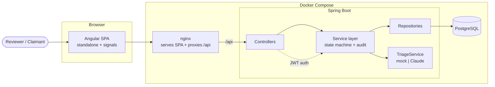

# Schadenflow

A small health-insurance claims-management portal: a claim moves through a
stewarded approval workflow with an append-only audit trail and role-based
access, plus an advisory AI triage step (summary + category suggestion) that a
caseworker always confirms.

> Portfolio project. Synthetic data only — no real PII, no production deployment,
> no real payment integration.

## Tech stack

- **Backend:** Java 21, Spring Boot, Maven, PostgreSQL (JPA/Hibernate), Flyway, JWT (Spring Security)
- **Frontend:** Angular 19 (standalone components + signals), Angular Material
- **Infra:** Docker Compose, nginx, GitHub Actions CI
- **AI triage:** `TriageService` abstraction — deterministic mock (default) or Anthropic Claude adapter

## Architecture



The backend is layered: thin **controllers** map domain errors to HTTP and a
consistent envelope (`{ "ok": true, "data": ... }` / `{ "ok": false, "error": { "code", "message" } }`);
a **service layer** owns the business rules; **repositories** isolate persistence.
The Angular SPA calls relative `/api` URLs, proxied to the backend by nginx (in
Docker) or the Angular dev server (locally).

### Claim state machine

A claim moves `EINGEREICHT → IN_PRUEFUNG → GENEHMIGT | ABGELEHNT → AUSBEZAHLT`.
Every transition is validated server-side and role-gated (reviewers move claims
through review; only an admin pays out), and each transition writes an
append-only **audit** row in the same transaction as the state change. Rejection
requires a reason.

### Authentication & roles

Login returns a stateless **JWT**; the SPA stores it and sends it as a bearer
token, and an HTTP interceptor redirects to login on `401`. Three roles —
`ANSPRUCHSTELLER` (claimant), `SACHBEARBEITER` (caseworker), `ADMIN` — gate both
API actions and UI affordances. The backend is always the authority; client-side
role checks are UX only.

### AI in the loop

Triage is **advisory and human-confirmed, never auto-applied**. A reviewer
requests a triage (summary, suggested category, missing-info flags); the UI shows
it as a clearly-labelled suggestion ("KI-Vorschlag — bitte bestätigen") and the
reviewer must explicitly confirm before anything is persisted. The triage
endpoint itself persists nothing. The provider is swappable behind
`TriageService`; the deterministic mock is the default and the only provider used
in tests/CI.

## Repository layout

| Path        | Contents |
|-------------|----------|
| `backend/`  | Spring Boot REST API |
| `frontend/` | Angular app |
| `infra/`    | Dockerfiles, nginx config |
| `docs/`     | Design specs and implementation plans |

## Running locally

Requires Docker. From the repo root:

```bash
docker compose up --build
```

- Frontend: <http://localhost:4200>
- API health: <http://localhost:8080/api/health>

The Compose stack runs the backend with the `dev` Spring profile, which seeds the
demo users below and permits the dev signing secret.

### Frontend dev server

For live frontend development against a locally-running API:

```bash
cd frontend
npm ci
npm start          # ng serve on http://localhost:4200, proxies /api -> http://localhost:8080
```

Start the backend separately (`docker compose up backend db`, or run the Spring
Boot app). The Angular dev server proxies `/api` via `frontend/proxy.conf.json`.

## Running tests

```bash
# backend (needs Docker — Testcontainers)
cd backend && mvn verify

# frontend (headless Chrome)
cd frontend && npm ci && npm test -- --watch=false --browsers=ChromeHeadless
```

GitHub Actions runs both on every push and pull request to `main`.

### Local development notes

**WSL2 + Docker Desktop:** Testcontainers may fail with a Docker API version
error (`MinAPIVersion` / HTTP 400). If you hit this, create
`~/.docker-java.properties` with a single line `api.version=1.44`. Not needed in
CI.

## Authentication

All `/api/*` endpoints except `/api/health` require a JWT bearer token.

```bash
curl -s -X POST http://localhost:8080/api/auth/login \
  -H "Content-Type: application/json" \
  -d '{"username":"admin","password":"password123"}'
```

Returns `{ "ok": true, "data": { "token": "<jwt>", "role": "ADMIN", ... } }`. Send
it as `Authorization: Bearer <token>` on subsequent requests.

**Seeded dev users** (synthetic; **only seeded under the `dev` profile**):

| Username | Password | Role |
|---|---|---|
| `anspruchsteller` | `password123` | ANSPRUCHSTELLER |
| `sachbearbeiter` | `password123` | SACHBEARBEITER |
| `admin` | `password123` | ADMIN |

## AI Triage

A reviewer (`SACHBEARBEITER` or `ADMIN`) can request an AI triage on a
pre-decision claim (`EINGEREICHT` or `IN_PRUEFUNG`):

```bash
POST /api/claims/{id}/triage      # advisory; persists nothing
PATCH /api/claims/{id}            # reviewer confirms { category, triageSummary }
```

The suggestion is never auto-applied — a caseworker confirms it via `PATCH`.

**Provider toggle:**

| Variable | Default | Notes |
|---|---|---|
| `SCHADENFLOW_TRIAGE_PROVIDER` | `mock` | `mock` (deterministic, no key, used in CI/tests) or `claude` (real Anthropic API) |
| `SCHADENFLOW_TRIAGE_MODEL` | `claude-opus-4-8` | Only used when provider is `claude` |
| `ANTHROPIC_API_KEY` | *(empty)* | Required when provider is `claude` |

## Security posture & production hardening

This is a portfolio app (synthetic data, not deployed), but it is built to be
**safe to run outside dev**:

- **Dev seed is gated.** The demo users live in `classpath:db/seed` and are only
  applied under the `dev` Spring profile. The default profile runs
  `classpath:db/migration` only — no seeded accounts.
- **The JWT secret fails fast.** Outside the `dev` profile, the app aborts startup
  if `security.jwt.secret` is missing, equals the known dev default, or is shorter
  than 32 bytes. Set a strong `SECURITY_JWT_SECRET`.

Before any real (non-dev) deployment you would additionally: run **without** the
`dev` profile, provide a strong `SECURITY_JWT_SECRET` and real database
credentials, terminate **TLS** in front of the app, and supply an
`ANTHROPIC_API_KEY` only if using the Claude triage provider.

## Status

Sub-projects 1–6 complete: infra & skeleton, claim domain + state machine,
security (JWT), AI triage, the Angular frontend, and polish + production
hardening. See `docs/superpowers/specs/` for the design and roadmap.
