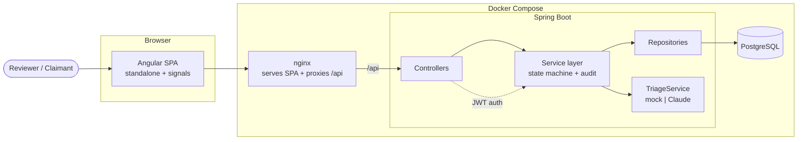

# Polish & Prod-Hardening (SP6) Implementation Plan

> **For agentic workers:** REQUIRED SUB-SKILL: Use superpowers:subagent-driven-development (recommended) or superpowers:executing-plans to implement this plan task-by-task. Steps use checkbox (`- [ ]`) syntax for tracking.

**Goal:** Close the two documented prod-hardening items via a single `dev` Spring profile (gate the dev seed; fail-fast on a weak/default JWT secret outside `dev`) and rewrite the root README as an architecture deep-dive.

**Architecture:** A pure `JwtSecretValidator` holds the validation rule; a `@Profile("!dev")` config invokes it at startup so non-dev boots abort on an unsafe secret. Flyway seed locations move into `application-dev.properties` so only the `dev` profile seeds dev users. Integration tests and `docker-compose.yml` activate the `dev` profile. The README is rewritten with a Mermaid architecture diagram and a security-posture section.

**Tech Stack:** Java 21, Spring Boot, Maven, Flyway, JUnit 5 + AssertJ, Testcontainers; Markdown + Mermaid.

## Global Constraints

- No new runtime dependencies; no new features/endpoints/UI. Hardening + docs only.
- Default (no-profile) posture = production: Flyway runs `classpath:db/migration` only (no seed); the JWT-secret fail-fast is active.
- `dev` profile = adds `classpath:db/seed` and exempts the JWT-secret check.
- JWT fail-fast rule (outside `dev`): abort startup if `security.jwt.secret` is blank, equals the dev default `dev-only-insecure-secret-change-me-0123456789`, or is shorter than 32 bytes (UTF-8).
- German for domain copy in docs where natural; English identifiers/prose.
- Backend test command: `cd backend && mvn -q verify` (needs Docker/Testcontainers). Expect green.
- Commit trailer on every commit, exactly:
  `Co-Authored-By: Claude Opus 4.8 (1M context) <noreply@anthropic.com>`
- Stage only the files each task names. Never commit `node_modules`, build output, or unrelated files.

### Reference: current state (do not re-derive)

`backend/src/main/resources/application.properties` (relevant lines):
```
spring.flyway.locations=classpath:db/migration,classpath:db/seed
security.jwt.secret=${SECURITY_JWT_SECRET:dev-only-insecure-secret-change-me-0123456789}
```
Seed file: `backend/src/main/resources/db/seed/V100__seed_dev_users.sql` (inserts `anspruchsteller`/`sachbearbeiter`/`admin`, all bcrypt `password123`).
`JwtService` reads `@Value("${security.jwt.secret}")`.
The 7 context-booting integration tests (each declares its own `@SpringBootTest @AutoConfigureMockMvc @Testcontainers` + `@Container @ServiceConnection`, no shared base):
- `backend/src/test/java/ch/sumex/schadenflow/ApplicationContextIT.java`
- `backend/src/test/java/ch/sumex/schadenflow/auth/AuthFlowIT.java`
- `backend/src/test/java/ch/sumex/schadenflow/auth/SecurityIntegrationIT.java`
- `backend/src/test/java/ch/sumex/schadenflow/claim/ClaimFlowIT.java`
- `backend/src/test/java/ch/sumex/schadenflow/claim/ClaimPersistenceIT.java`
- `backend/src/test/java/ch/sumex/schadenflow/claim/TriageFlowIT.java`
- `backend/src/test/java/ch/sumex/schadenflow/user/UserPersistenceIT.java`
`docker-compose.yml` backend service already sets `SECURITY_JWT_SECRET` (with the dev default fallback) and the triage envs.

---

## Task 1: JwtSecretValidator (pure validation rule)

**Files:**
- Create: `backend/src/main/java/ch/sumex/schadenflow/auth/JwtSecretValidator.java`
- Test: `backend/src/test/java/ch/sumex/schadenflow/auth/JwtSecretValidatorTest.java`

**Interfaces:**
- Consumes: nothing.
- Produces: `final class JwtSecretValidator` with `public static final String DEV_DEFAULT_SECRET`; `public static void validate(String secret)` — throws `IllegalStateException` when secret is null/blank, equals `DEV_DEFAULT_SECRET`, or is < 32 bytes (UTF-8); returns normally otherwise.

- [ ] **Step 1: Write the failing test**

`backend/src/test/java/ch/sumex/schadenflow/auth/JwtSecretValidatorTest.java`:

```java
package ch.sumex.schadenflow.auth;

import org.junit.jupiter.api.Test;

import static org.assertj.core.api.Assertions.assertThatCode;
import static org.assertj.core.api.Assertions.assertThatThrownBy;

class JwtSecretValidatorTest {

    @Test
    void rejectsTheDevDefaultSecret() {
        assertThatThrownBy(() -> JwtSecretValidator.validate(JwtSecretValidator.DEV_DEFAULT_SECRET))
                .isInstanceOf(IllegalStateException.class)
                .hasMessageContaining("dev default");
    }

    @Test
    void rejectsASecretShorterThan32Bytes() {
        assertThatThrownBy(() -> JwtSecretValidator.validate("too-short-secret"))
                .isInstanceOf(IllegalStateException.class)
                .hasMessageContaining("32 bytes");
    }

    @Test
    void rejectsABlankSecret() {
        assertThatThrownBy(() -> JwtSecretValidator.validate("   "))
                .isInstanceOf(IllegalStateException.class);
    }

    @Test
    void rejectsNull() {
        assertThatThrownBy(() -> JwtSecretValidator.validate(null))
                .isInstanceOf(IllegalStateException.class);
    }

    @Test
    void acceptsAStrongNonDefaultSecret() {
        assertThatCode(() -> JwtSecretValidator.validate("this-is-a-strong-secret-of-sufficient-length-1234"))
                .doesNotThrowAnyException();
    }
}
```

- [ ] **Step 2: Run test to verify it fails**

Run: `cd backend && mvn -q -Dtest=JwtSecretValidatorTest test`
Expected: FAIL — `JwtSecretValidator` does not exist (compilation error).

- [ ] **Step 3: Implement the validator**

`backend/src/main/java/ch/sumex/schadenflow/auth/JwtSecretValidator.java`:

```java
package ch.sumex.schadenflow.auth;

import java.nio.charset.StandardCharsets;

/**
 * Validates the configured JWT signing secret. Used by a {@code @Profile("!dev")}
 * startup check so a non-dev boot aborts with a clear message rather than running
 * with the publicly-known dev default. (JJWT's {@code hmacShaKeyFor} also rejects
 * short keys, but later and with a cryptic message.)
 */
public final class JwtSecretValidator {

    public static final String DEV_DEFAULT_SECRET = "dev-only-insecure-secret-change-me-0123456789";

    private static final int MIN_BYTES = 32;

    private JwtSecretValidator() {
    }

    public static void validate(String secret) {
        if (secret == null || secret.isBlank()) {
            throw new IllegalStateException(
                    "security.jwt.secret must be set to a strong value outside the 'dev' profile");
        }
        if (secret.equals(DEV_DEFAULT_SECRET)) {
            throw new IllegalStateException(
                    "security.jwt.secret is the insecure dev default; set a strong SECURITY_JWT_SECRET "
                            + "outside the 'dev' profile");
        }
        if (secret.getBytes(StandardCharsets.UTF_8).length < MIN_BYTES) {
            throw new IllegalStateException(
                    "security.jwt.secret must be at least 32 bytes; set a strong SECURITY_JWT_SECRET "
                            + "outside the 'dev' profile");
        }
    }
}
```

- [ ] **Step 4: Run test to verify it passes**

Run: `cd backend && mvn -q -Dtest=JwtSecretValidatorTest test`
Expected: PASS (5 tests).

- [ ] **Step 5: Commit**

```bash
git add backend/src/main/java/ch/sumex/schadenflow/auth/JwtSecretValidator.java \
  backend/src/test/java/ch/sumex/schadenflow/auth/JwtSecretValidatorTest.java
git commit -m "feat(security): add JwtSecretValidator with dev-default and length checks

Co-Authored-By: Claude Opus 4.8 (1M context) <noreply@anthropic.com>"
```

---

## Task 2: Activate hardening — dev profile, seed gating, fail-fast wiring

**Files:**
- Create: `backend/src/main/resources/application-dev.properties`
- Modify: `backend/src/main/resources/application.properties` (the `spring.flyway.locations` line)
- Create: `backend/src/main/java/ch/sumex/schadenflow/auth/JwtSecretValidationConfig.java`
- Create: `backend/src/test/java/ch/sumex/schadenflow/auth/JwtSecretValidationConfigTest.java`
- Modify (add `@ActiveProfiles("dev")` + import to each): the 7 IT files listed in Global Constraints.
- Modify: `docker-compose.yml` (backend service env)

**Interfaces:**
- Consumes: `JwtSecretValidator.validate` and `JwtSecretValidator.DEV_DEFAULT_SECRET` (Task 1).
- Produces: `@Configuration @Profile("!dev")` `JwtSecretValidationConfig` that validates `security.jwt.secret` at startup. After this task the default profile has no seed and rejects the dev secret; the `dev` profile seeds and is exempt; all ITs run under `dev`.

> Why combined: the seed gating and the fail-fast both hinge on the `dev` profile and the IT activation. Landing them together (with the IT `@ActiveProfiles` in the same commit) is what keeps `mvn verify` green at the commit boundary — splitting them would leave the suite red in between.

- [ ] **Step 1: Write the failing wiring test**

`backend/src/test/java/ch/sumex/schadenflow/auth/JwtSecretValidationConfigTest.java`:

```java
package ch.sumex.schadenflow.auth;

import org.junit.jupiter.api.Test;
import org.springframework.boot.test.context.runner.ApplicationContextRunner;

import static org.assertj.core.api.Assertions.assertThat;

class JwtSecretValidationConfigTest {

    // No active profile -> @Profile("!dev") config IS included, mirroring a prod boot.
    private final ApplicationContextRunner runner = new ApplicationContextRunner()
            .withUserConfiguration(JwtSecretValidationConfig.class);

    @Test
    void contextFailsWithTheDevDefaultSecretOutsideDev() {
        runner.withPropertyValues("security.jwt.secret=" + JwtSecretValidator.DEV_DEFAULT_SECRET)
                .run(ctx -> assertThat(ctx).hasFailed());
    }

    @Test
    void contextFailsWithAShortSecretOutsideDev() {
        runner.withPropertyValues("security.jwt.secret=too-short")
                .run(ctx -> assertThat(ctx).hasFailed());
    }

    @Test
    void contextStartsWithAStrongSecret() {
        runner.withPropertyValues(
                        "security.jwt.secret=this-is-a-strong-secret-of-sufficient-length-1234")
                .run(ctx -> assertThat(ctx).hasNotFailed());
    }
}
```

- [ ] **Step 2: Run test to verify it fails**

Run: `cd backend && mvn -q -Dtest=JwtSecretValidationConfigTest test`
Expected: FAIL — `JwtSecretValidationConfig` does not exist (compilation error).

- [ ] **Step 3: Implement the profile-gated validation config**

`backend/src/main/java/ch/sumex/schadenflow/auth/JwtSecretValidationConfig.java`:

```java
package ch.sumex.schadenflow.auth;

import jakarta.annotation.PostConstruct;
import org.springframework.beans.factory.annotation.Value;
import org.springframework.context.annotation.Configuration;
import org.springframework.context.annotation.Profile;

/**
 * Fails application startup outside the {@code dev} profile when the JWT signing
 * secret is weak or the publicly-known dev default. Inside {@code dev} this bean
 * is absent, so the dev default is tolerated for local runs and tests.
 */
@Configuration
@Profile("!dev")
public class JwtSecretValidationConfig {

    private final String secret;

    public JwtSecretValidationConfig(@Value("${security.jwt.secret}") String secret) {
        this.secret = secret;
    }

    @PostConstruct
    void validateSecret() {
        JwtSecretValidator.validate(secret);
    }
}
```

- [ ] **Step 4: Run the wiring test to verify it passes**

Run: `cd backend && mvn -q -Dtest=JwtSecretValidationConfigTest test`
Expected: PASS (3 tests).

- [ ] **Step 5: Gate the seed behind the dev profile**

Edit `backend/src/main/resources/application.properties` — change the flyway line to migrations only:

```
spring.flyway.locations=classpath:db/migration
```

Create `backend/src/main/resources/application-dev.properties`:

```
# Dev profile: add the seed migrations (dev users) on top of the base schema.
spring.flyway.locations=classpath:db/migration,classpath:db/seed
```

- [ ] **Step 6: Activate the dev profile in every context-booting integration test**

For EACH of the 7 IT files listed in Global Constraints, add the import and the class-level annotation. Add the import alongside the other Spring test imports:

```java
import org.springframework.test.context.ActiveProfiles;
```

and add `@ActiveProfiles("dev")` to the class, immediately above the `class` declaration (with the existing `@SpringBootTest`/`@AutoConfigureMockMvc`/`@Testcontainers` annotations). Example for `AuthFlowIT` (apply the same to all 7):

```java
@SpringBootTest
@AutoConfigureMockMvc
@Testcontainers
@ActiveProfiles("dev")
class AuthFlowIT {
```

Do not change anything else in those files.

- [ ] **Step 7: Activate the dev profile for the local Docker run**

In `docker-compose.yml`, under the `backend:` service `environment:` block, add (keep all existing env entries):

```yaml
      SPRING_PROFILES_ACTIVE: dev
```

- [ ] **Step 8: Run the full backend suite**

Run: `cd backend && mvn -q verify`
Expected: BUILD SUCCESS. All integration tests pass under the `dev` profile (seed users present; JWT check skipped); unit tests including `JwtSecretValidatorTest` and `JwtSecretValidationConfigTest` pass. Test count = previous 74 + 5 (validator) + 3 (config wiring) = 82.

> If any `@SpringBootTest` IT fails to start complaining about the secret or missing seed users, it is missing `@ActiveProfiles("dev")` — add it (Step 6) and re-run.

- [ ] **Step 9: Commit**

```bash
git add backend/src/main/resources/application.properties \
  backend/src/main/resources/application-dev.properties \
  backend/src/main/java/ch/sumex/schadenflow/auth/JwtSecretValidationConfig.java \
  backend/src/test/java/ch/sumex/schadenflow/auth/JwtSecretValidationConfigTest.java \
  backend/src/test/java/ch/sumex/schadenflow/ApplicationContextIT.java \
  backend/src/test/java/ch/sumex/schadenflow/auth/AuthFlowIT.java \
  backend/src/test/java/ch/sumex/schadenflow/auth/SecurityIntegrationIT.java \
  backend/src/test/java/ch/sumex/schadenflow/claim/ClaimFlowIT.java \
  backend/src/test/java/ch/sumex/schadenflow/claim/ClaimPersistenceIT.java \
  backend/src/test/java/ch/sumex/schadenflow/claim/TriageFlowIT.java \
  backend/src/test/java/ch/sumex/schadenflow/user/UserPersistenceIT.java \
  docker-compose.yml
git commit -m "feat(security): gate dev seed behind dev profile; fail-fast on weak JWT secret

Co-Authored-By: Claude Opus 4.8 (1M context) <noreply@anthropic.com>"
```

---

## Task 3: README architecture deep-dive

**Files:**
- Modify: `README.md` (full rewrite of the body; preserve accurate existing content where it already fits the new structure)

**Interfaces:**
- Consumes: nothing (docs).
- Produces: the public repo's front-door README.

- [ ] **Step 1: Rewrite `README.md`**

Replace the entire contents of `README.md` with:

````markdown
# Schadenflow

A small health-insurance claims-management portal: a claim moves through a
stewarded approval workflow with an append-only audit trail and role-based
access, plus an advisory AI triage step (summary + category suggestion) that a
caseworker always confirms.

> Portfolio project. Synthetic data only — no real PII, no production deployment,
> no real payment integration.

## Tech stack

- **Backend:** Java 21, Spring Boot, Maven, PostgreSQL (JPA/Hibernate), Flyway, JWT (Spring Security)
- **Frontend:** Angular 19 (standalone components + signals), Angular Material
- **Infra:** Docker Compose, nginx, GitHub Actions CI
- **AI triage:** `TriageService` abstraction — deterministic mock (default) or Anthropic Claude adapter

## Architecture



The backend is layered: thin **controllers** map domain errors to HTTP and a
consistent envelope (`{ "ok": true, "data": ... }` / `{ "ok": false, "error": { "code", "message" } }`);
a **service layer** owns the business rules; **repositories** isolate persistence.
The Angular SPA calls relative `/api` URLs, proxied to the backend by nginx (in
Docker) or the Angular dev server (locally).

### Claim state machine

A claim moves `EINGEREICHT → IN_PRUEFUNG → GENEHMIGT | ABGELEHNT → AUSBEZAHLT`.
Every transition is validated server-side and role-gated (reviewers move claims
through review; only an admin pays out), and each transition writes an
append-only **audit** row in the same transaction as the state change. Rejection
requires a reason.

### Authentication & roles

Login returns a stateless **JWT**; the SPA stores it and sends it as a bearer
token, and an HTTP interceptor redirects to login on `401`. Three roles —
`ANSPRUCHSTELLER` (claimant), `SACHBEARBEITER` (caseworker), `ADMIN` — gate both
API actions and UI affordances. The backend is always the authority; client-side
role checks are UX only.

### AI in the loop

Triage is **advisory and human-confirmed, never auto-applied**. A reviewer
requests a triage (summary, suggested category, missing-info flags); the UI shows
it as a clearly-labelled suggestion ("KI-Vorschlag — bitte bestätigen") and the
reviewer must explicitly confirm before anything is persisted. The triage
endpoint itself persists nothing. The provider is swappable behind
`TriageService`; the deterministic mock is the default and the only provider used
in tests/CI.

## Repository layout

| Path        | Contents |
|-------------|----------|
| `backend/`  | Spring Boot REST API |
| `frontend/` | Angular app |
| `infra/`    | Dockerfiles, nginx config |
| `docs/`     | Design specs and implementation plans |

## Running locally

Requires Docker. From the repo root:

```bash
docker compose up --build
```

- Frontend: <http://localhost:4200>
- API health: <http://localhost:8080/api/health>

The Compose stack runs the backend with the `dev` Spring profile, which seeds the
demo users below and permits the dev signing secret.

### Frontend dev server

For live frontend development against a locally-running API:

```bash
cd frontend
npm ci
npm start          # ng serve on http://localhost:4200, proxies /api -> http://localhost:8080
```

Start the backend separately (`docker compose up backend db`, or run the Spring
Boot app). The Angular dev server proxies `/api` via `frontend/proxy.conf.json`.

## Running tests

```bash
# backend (needs Docker — Testcontainers)
cd backend && mvn verify

# frontend (headless Chrome)
cd frontend && npm ci && npm test -- --watch=false --browsers=ChromeHeadless
```

GitHub Actions runs both on every push and pull request to `main`.

### Local development notes

**WSL2 + Docker Desktop:** Testcontainers may fail with a Docker API version
error (`MinAPIVersion` / HTTP 400). If you hit this, create
`~/.docker-java.properties` with a single line `api.version=1.44`. Not needed in
CI.

## Authentication

All `/api/*` endpoints except `/api/health` require a JWT bearer token.

```bash
curl -s -X POST http://localhost:8080/api/auth/login \
  -H "Content-Type: application/json" \
  -d '{"username":"admin","password":"password123"}'
```

Returns `{ "ok": true, "data": { "token": "<jwt>", "role": "ADMIN", ... } }`. Send
it as `Authorization: Bearer <token>` on subsequent requests.

**Seeded dev users** (synthetic; **only seeded under the `dev` profile**):

| Username | Password | Role |
|---|---|---|
| `anspruchsteller` | `password123` | ANSPRUCHSTELLER |
| `sachbearbeiter` | `password123` | SACHBEARBEITER |
| `admin` | `password123` | ADMIN |

## AI Triage

A reviewer (`SACHBEARBEITER` or `ADMIN`) can request an AI triage on a
pre-decision claim (`EINGEREICHT` or `IN_PRUEFUNG`):

```bash
POST /api/claims/{id}/triage      # advisory; persists nothing
PATCH /api/claims/{id}            # reviewer confirms { category, triageSummary }
```

The suggestion is never auto-applied — a caseworker confirms it via `PATCH`.

**Provider toggle:**

| Variable | Default | Notes |
|---|---|---|
| `SCHADENFLOW_TRIAGE_PROVIDER` | `mock` | `mock` (deterministic, no key, used in CI/tests) or `claude` (real Anthropic API) |
| `SCHADENFLOW_TRIAGE_MODEL` | `claude-opus-4-8` | Only used when provider is `claude` |
| `ANTHROPIC_API_KEY` | *(empty)* | Required when provider is `claude` |

## Security posture & production hardening

This is a portfolio app (synthetic data, not deployed), but it is built to be
**safe to run outside dev**:

- **Dev seed is gated.** The demo users live in `classpath:db/seed` and are only
  applied under the `dev` Spring profile. The default profile runs
  `classpath:db/migration` only — no seeded accounts.
- **The JWT secret fails fast.** Outside the `dev` profile, the app aborts startup
  if `security.jwt.secret` is missing, equals the known dev default, or is shorter
  than 32 bytes. Set a strong `SECURITY_JWT_SECRET`.

Before any real (non-dev) deployment you would additionally: run **without** the
`dev` profile, provide a strong `SECURITY_JWT_SECRET` and real database
credentials, terminate **TLS** in front of the app, and supply an
`ANTHROPIC_API_KEY` only if using the Claude triage provider.

## Status

Sub-projects 1–6 complete: infra & skeleton, claim domain + state machine,
security (JWT), AI triage, the Angular frontend, and polish + production
hardening. See `docs/superpowers/specs/` for the design and roadmap.
````

- [ ] **Step 2: Sanity-check the Markdown and Mermaid**

Run: `cd /home/reblayzer/dev/schadenflow && grep -c '```mermaid' README.md`
Expected: `1` (the diagram fence is present).
Visually confirm the file has balanced code fences (each ```` ``` ```` opens and closes) and that the Status section says "1–6 complete". (GitHub renders the Mermaid block natively; there is no local renderer in CI.)

- [ ] **Step 3: Commit**

```bash
git add README.md
git commit -m "docs: rewrite README as architecture deep-dive with security posture

Co-Authored-By: Claude Opus 4.8 (1M context) <noreply@anthropic.com>"
```

---

## Self-Review

**Spec coverage** (against `2026-06-27-polish-hardening-design.md`):
- §5.1 seed gating — Task 2 Step 5 (base props → migrations only; `application-dev.properties` adds seed). ✓
- §5.2 JWT fail-fast — Task 1 (validator) + Task 2 Steps 1–4 (`@Profile("!dev")` config + wiring test). ✓
- §5.3 net behavior — enforced by the above; verified by `JwtSecretValidationConfigTest` (fails outside dev) and ITs green under dev. ✓
- §6 test & compose wiring — Task 2 Steps 6 (`@ActiveProfiles("dev")` on all 7 ITs), 7 (`SPRING_PROFILES_ACTIVE=dev` in compose), 8 (full `mvn verify`). ✓
- §7 README deep-dive (overview, Mermaid architecture, state machine, auth, AI-in-the-loop, repo layout, run, test, auth/seed-is-dev-only, triage, security posture, status) — Task 3. ✓
- §8 CI — no workflow change; `mvn verify` is the gate (Task 2 Step 8) and the SP6 PR re-runs CI. ✓

**Placeholder scan:** no TBD/TODO; every code/edit step shows the exact content. The README is provided in full. ✓

**Type consistency:** `JwtSecretValidator.validate` / `DEV_DEFAULT_SECRET` are defined in Task 1 and consumed verbatim in Task 2 (`JwtSecretValidationConfig` and `JwtSecretValidationConfigTest`). The 7 IT paths match the Global Constraints list exactly. The dev-default literal string is identical in the validator, the properties fallback, and the README. ✓

**Note for the implementer:** `mvn verify` requires Docker (Testcontainers). If the environment hits the WSL2 Docker API error, apply the `~/.docker-java.properties` workaround from the README before running Task 2 Step 8.
